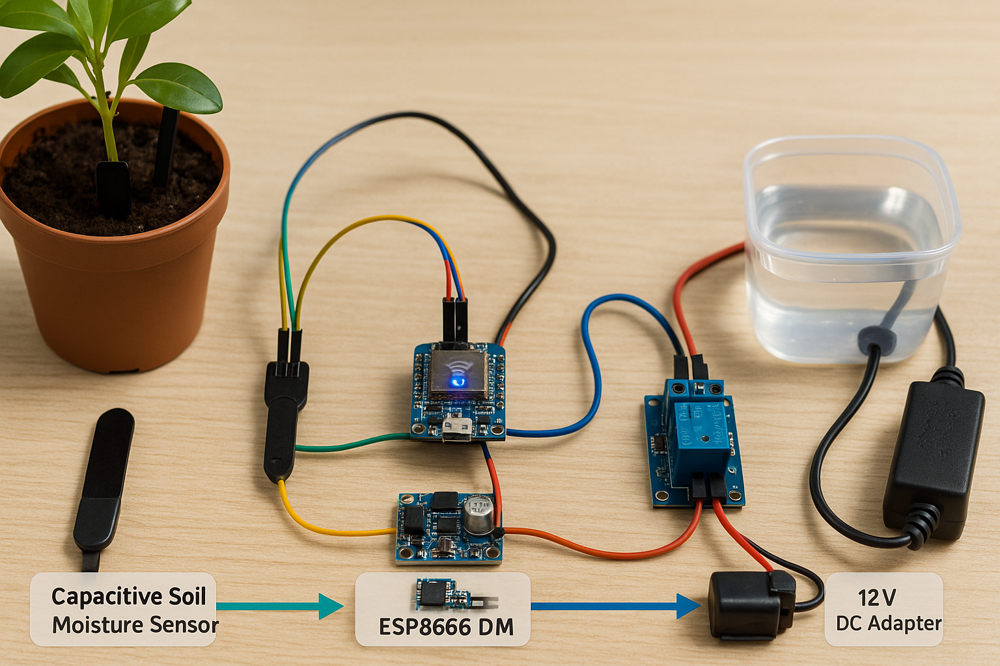

<!-- Hero Demo Video -->

  <video src="media/applicerar_fukt.mp4" controls width="75%">
    Sorry—your browser doesn’t support embedded video.
  </video>

<h1 align="center">🌱 Automatic Irrigation System</h1>

> **A Wi-Fi-enabled plant-watering controller that keeps your greens thriving while you work on bigger projects.**

---

## 🖼 Screenshot & Diagram Gallery

| | |
|---|---|
|  | *Early design sketch* |
|  | *High-level wiring overview* |

---

## 🔧 Soldering Walk-through

  <video src="media/petrit_loddar.mp4" controls width="65%">
    Sorry—your browser doesn’t support embedded video.
  </video>

*A quick look at hand-soldering the headers and relay connections.*

