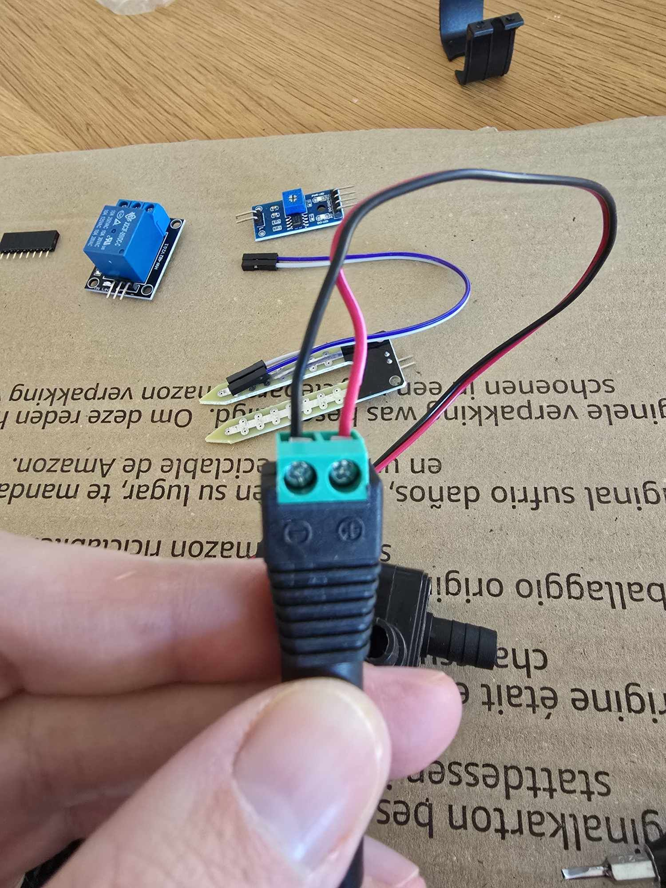

<!-- Banner / Logo -->
<p align="center">
  
</p>

<h1 align="center">🌱 Automatic Irrigation System</h1>

> **Smart, Wi-Fi-enabled plant-watering that learns your soil’s needs and keeps your greens thriving—while you code the next big thing.**

<div align="center">


</div>

---

## 🎥 Demo

<p align="center">
  <video src="media/Vattenpump_Slas_Av.mp4" controls width="70%">
    Sorry—your browser doesn’t support embedded video.
  </video>
</p>

---

## ✨ Features at a glance

| Capability | Details |
|------------|---------|
| 🌡 **Live moisture sensing** | Capacitive sensor logs soil %RH every 10 s |
| 💧 **Automatic pump control** | 12 V DC pump toggled via 5 V relay |
| 📶 **Wi-Fi + Web UI** | ESP8266 hosts a mobile-friendly dashboard |
| 🕒 **Scheduling & logging** | Time-based watering + CSV log download |
| 🔌 **Fail-safe manual mode** | Hardware button overrides automation |

---

## 🖼 Screenshot Gallery

| | |
|---|---|
|  | *Fully wired controller & power rail* |
|  | *Through-hole headers ready for solder* |
|  | *Workbench snapshot during assembly* |

---

## 🛠 Architecture

```mermaid
flowchart LR
  subgraph Power
    A12V["12 V DC Adapter"] --> BPump["Mini Water Pump"]
    A12V --> VR["Step-down<br/>5 V Reg."]
  end
  VR --> RLY["5 V Relay Module"]
  RLY --> BPump
  CSensor["Capacitive Moisture Sensor"] -->|ADC| D1Mini
  D1Mini["ESP8266 D1 Mini<br/>(MicroPython)"] -->|GPIO| RLY
  D1Mini -->|Wi-Fi| Phone["📱 Browser UI"]
